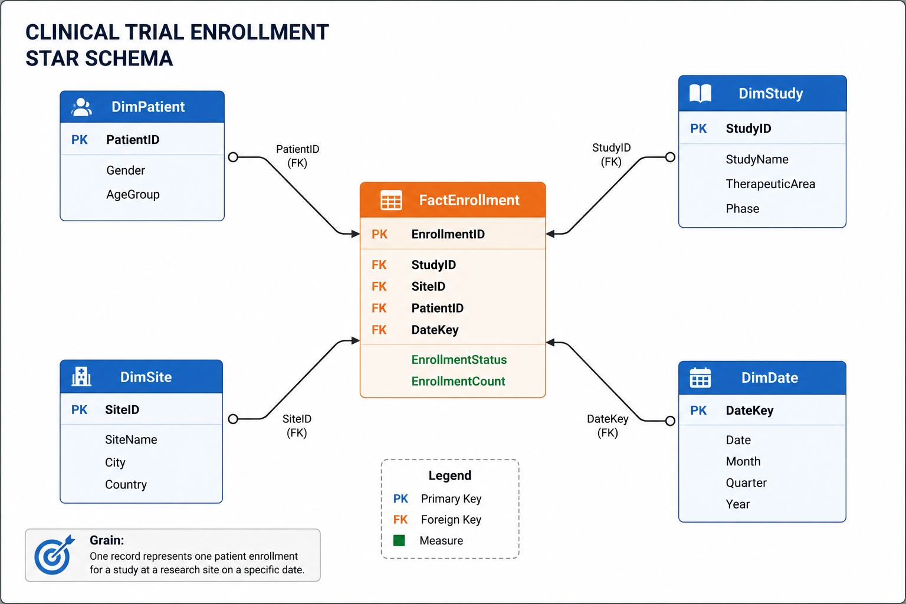

# 🏥 Clinical Trial Site Enrollment Data Warehouse


A dimensional data warehouse project that models **clinical trial site enrollment data** using a **Star Schema**. This project demonstrates dimensional modeling concepts commonly used in enterprise data warehouses to support business intelligence (BI) and analytical reporting.

---

# 📌 Project Overview

Clinical trial organizations collect data from multiple operational systems such as patient registration, study management, and research site operations. These systems are optimized for transactions (OLTP) but are not suitable for analytical reporting.

This project restructures the operational data into a dimensional data warehouse that enables fast and efficient reporting on:

- Patient enrollment trends
- Site performance
- Study performance
- Enrollment status
- Therapeutic area analysis
- Time-based reporting

---

# 🎯 Business Problem

Operational databases store data in a normalized format designed for transactions.

Business users often ask questions such as:

- Which clinical site enrolled the most patients?
- Which study has the highest enrollment?
- How many patients enrolled each month?
- Which therapeutic area is performing best?
- What is the distribution of enrollment status?

Running these reports directly on transactional databases is slow and inefficient.

A dimensional data warehouse solves this problem by organizing data into Fact and Dimension tables.

---

# 🏗️ Data Warehouse Architecture

```
                 Source CSV Files

      Patients.csv
      Studies.csv
      Sites.csv
      Dates.csv
      Enrollments.csv
               │
               ▼

        Star Schema Design

           FactEnrollment
                 │
     ┌───────────┼───────────┐
     │           │           │
 DimPatient  DimStudy   DimSite
                 │
             DimDate

               │
               ▼

      Analytical SQL Queries
```

---

# ⭐ Star Schema

> Replace this image after adding your professional diagram.



---

# 📂 Project Structure

```
Clinical-Trial-Data-Warehouse
│
├── data
│   ├── patients.csv
│   ├── studies.csv
│   ├── sites.csv
│   ├── dates.csv
│   └── enrollments.csv
│
├── schema
│   └── create_tables.sql
│
├── sql
│   ├── analytical_queries.sql
│   └── sample_queries.sql
│
├── images
│   └── star_schema.png
│
└── README.md
```

---

# 🗄️ Data Model

## Fact Table

### FactEnrollment

Stores one patient enrollment event.

| Column |
|---------|
| EnrollmentID |
| PatientID |
| StudyID |
| SiteID |
| DateKey |
| EnrollmentStatus |
| EnrollmentCount |

### Grain

**One record represents one patient enrolled into one study at one research site on one specific date.**

---

## Dimension Tables

### DimPatient

- PatientID
- Gender
- AgeGroup

### DimStudy

- StudyID
- StudyName
- TherapeuticArea
- Phase

### DimSite

- SiteID
- SiteName
- City
- Country

### DimDate

- DateKey
- Date
- Month
- Quarter
- Year

---

# 🔍 Example Business Questions

This warehouse answers questions such as:

- Which site enrolled the highest number of patients?
- Which study has the highest enrollment?
- Monthly enrollment trends
- Enrollment by gender
- Enrollment by age group
- Phase-wise enrollment
- Therapeutic area performance
- Site-wise performance
- City-wise enrollment
- Enrollment status distribution

---

# 💻 Sample SQL Query

```sql
SELECT
    s.SiteName,
    SUM(f.EnrollmentCount) AS TotalEnrollments
FROM FactEnrollment f
JOIN DimSite s
    ON f.SiteID = s.SiteID
GROUP BY s.SiteName
ORDER BY TotalEnrollments DESC;
```

---

# 🛠️ Technologies Used

- SQL
- SQLite
- Star Schema
- Dimensional Modeling
- Data Warehousing
- Git
- GitHub

---

# 📈 Key Concepts Demonstrated

- Star Schema Design
- Fact and Dimension Tables
- Primary & Foreign Keys
- Grain Definition
- Dimensional Modeling
- Business Intelligence Reporting
- SQL Analytics
- Data Warehouse Best Practices

---

# 🚀 How to Run

1. Clone the repository

```bash
git clone https://github.com/<your-username>/Clinical-Trial-Data-Warehouse.git
```

2. Open the database using SQLite or DB Browser for SQLite.

3. Execute the scripts inside the `schema/` folder.

4. Load the CSV files.

5. Execute the SQL queries inside the `sql/` folder.

---

# 📊 Future Enhancements

- ETL Pipeline using Python
- Azure Data Factory implementation
- Databricks version
- Power BI Dashboard
- Slowly Changing Dimensions (SCD Type 2)
- Data Quality Validation
- Incremental Data Loading

---

# 👨‍💻 Author

*Rajeshwari Kapse*

Data Engineer | SQL | Azure | Databricks | Data Warehousing

---

⭐ If you found this project useful, consider giving it a star.
